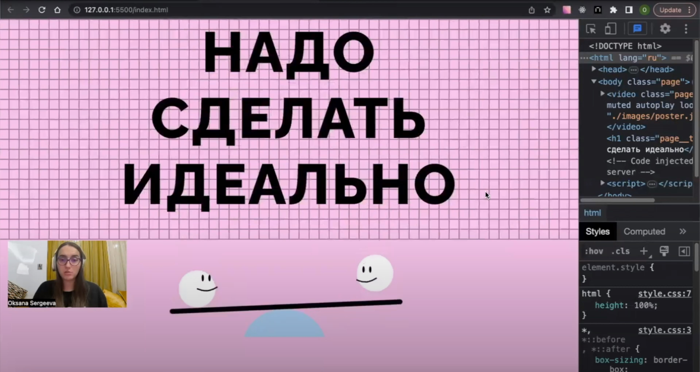

# Надо сделать идеально!!!

Нашим готовым кейсом с этот раз станет проект «Надо сделать идеально». На первый взгляд, [в макете](https://www.figma.com/file/8oKbCdYbLgfDehpQNJEoMS/%233-Надо-сделать-идеально?type=design&node-id=0-1&mode=design&t=EnjJrxRqQzknFTAt-0) этого проекта нет ничего особенного. Всего-то видео на фоне, заголовок и тултип, всплывающий при наведении на заголовок. Однако за внешней простотой скрывается немало важных деталей. Каких? Давайте разбираться!

Самый эффективный путь всё еще неизменен. Для этого мы рекомендуем вам:
- ознакомиться с предложенным [макетом](https://www.figma.com/file/8oKbCdYbLgfDehpQNJEoMS/%233-Надо-сделать-идеально?type=design&node-id=0-1&mode=design&t=EnjJrxRqQzknFTAt-0);
- опирайтесь на рекомендации для данного проекта, когда будете смотреть видеоразбор;
- просмотреть чек-лист, который поможет расставить акценты при просмотре видео;
- перейти к видеоразбору;
- ответить на парочку вопросов после видео.

### [Видеоразбор готового кейса «Надо сделать идеально»](https://www.youtube.com/watch?v=lsJNXKRfqOQ)

